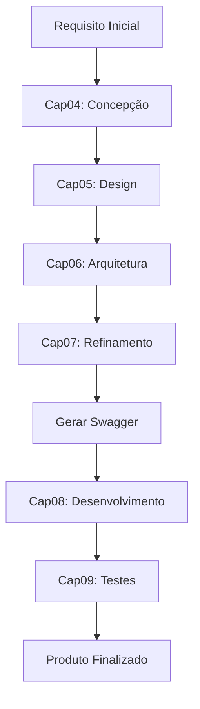

# Heuristic-Driven SDLC

[](https://creativecommons.org/licenses/by-nc-nd/4.0/)

**Heurísticas de Teste como Sistema de Decisão Técnica**

> Material prático e exemplos do livro sobre aplicação de heurísticas de teste no ciclo de vida de desenvolvimento de software (SDLC).

Copyright © 2026 Qualiters Club  
**Autores:** Priscila Caimi e Jonatas Martins

---

## 📋 Sobre o Projeto

Este repositório contém a aplicação prática de **heurísticas de teste** como ferramenta de decisão técnica ao longo de todo o ciclo de desenvolvimento de software. O material está organizado seguindo as etapas do SDLC, desde a concepção até os testes, demonstrando como heurísticas podem guiar decisões arquiteturais, de design e implementação.

### Objetivo

Transformar heurísticas de teste de ferramentas reativas (usadas apenas na fase de testes) em **sistemas de decisão proativos** que orientam todo o processo de desenvolvimento, resultando em:

- ✅ Requisitos mais robustos e completos
- ✅ Arquitetura que antecipa cenários de uso complexos
- ✅ Código mais resiliente a falhas e edge cases
- ✅ Documentação técnica estruturada (OpenAPI/Swagger)
- ✅ Testes mais alinhados com riscos reais

---

## 🗂️ Estrutura do Repositório

```
heuristic-driven-SDLC/
├── input/                          # Requisito base de entrada
│   └── REQ_INICIAL.MD             # Especificação técnica do requisito
│
├── Skill/                          # Heurísticas organizadas por capítulo/etapa
│   ├── Cap04_concepcao/           # Heurísticas de Concepção
│   │   ├── UserScenarios.md       # Cenários de uso dinâmicos
│   │   └── WWWWWHKE.MD            # Análise de contexto (Who, What, Where, When, Why, How, Keep, Exclude)
│   │
│   ├── Cap05_design/              # Heurísticas de Design
│   │   ├── Dependencies.md        # Análise de dependências
│   │   ├── MultiUser.md           # Cenários multi-usuário
│   │   └── StateAnalysis.md       # Análise de estados
│   │
│   ├── Cap06_arquitetura/         # Heurísticas de Arquitetura
│   │   ├── Count.md               # Análise de contadores e limites
│   │   └── CRUD.md                # Operações CRUD e consistência
│   │
│   ├── Cap07_refinamento/         # Heurísticas de Refinamento
│   │   ├── Chique.md              # Refinamento de qualidade
│   │   ├── InputMethod.md         # Métodos de entrada
│   │   └── SeenAndHeard.md        # Feedback e percepção do usuário
│   │
│   ├── Cap08_desenvolvimento/     # Heurísticas de Desenvolvimento
│   │   ├── Baica.md               # Análise de baixo nível
│   │   ├── VADER.md               # Validação, Asserção, Dados, Exceções, Resultados
│   │   └── FAILURE.md             # Cenários de falha
│   │
│   └── Cap09_teste/               # Heurísticas de Teste
│       ├── EMOTIONS.md            # Testes emocionais/comportamentais
│       ├── FAILURE.md             # Testes de falha
│       └── FLOOD.md               # Testes de carga e limites
│
├── docs/                           # Documentação de suporte
│   ├── builSwagger/
│   │   └── SWAGGER_API_DOC.md     # Geração de documentação OpenAPI
│   └── test/                       # Guias de testes
│       ├── TEST_STRATEGY.md
│       ├── TEST_UNIT_GUIDE.md
│       ├── TEST_INTEGRATION_GUIDE.md
│       ├── TEST_COMPONENT_GUIDE.md
│       ├── TEST_SERVICE_GUIDE.md
│       └── TEST_E2E_GUIDE.md
│
├── example-book/                   # Exemplos práticos aplicados
│   ├── cap-04-concepcao/          # Outputs da fase de concepção
│   ├── cap-05-design/             # Outputs da fase de design
│   ├── cap-06-arquitetura/        # Outputs da fase de arquitetura
│   └── cap-07-refinamento/        # Outputs da fase de refinamento
│
├── output/                         # Artefatos gerados
│   ├── requisito-revisado/        # Requisito revisado após aplicação das heurísticas
│   │   └── REQ_INICIAL_V2.md
│   └── swagger/                   # Documentação OpenAPI gerada
│       └── envio_qualipoints/     # Exemplo: Transferência de QualiPoints
│           ├── openapi.yaml       # Especificação OpenAPI 3.0.3
│           └── README.md          # Documentação do endpoint
│
├── LICENSE                         # Licença CC BY-NC-ND 4.0
└── README.md                       # Este arquivo
```

> **`Skill/`** contém heurísticas de **análise** — orientam o que investigar e quais perguntas fazer em cada fase do SDLC.
> **`docs/`** contém guias de **implementação** — orientam como construir os artefatos resultantes (Swagger, testes).

---

## 🚀 Como Utilizar

### 1️⃣ Aplicar Heurísticas no Seu Projeto

Cada heurística na pasta `Skill/` é uma skill independente que pode ser aplicada em diferentes fases do SDLC:

```bash
# Exemplo: Aplicar a heurística User Scenarios
# Leia o arquivo Skill/Cap04_concepcao/UserScenarios.md
# E siga as instruções para gerar cenários de uso a partir dos seus requisitos
```

**Estrutura típica de uma heurística:**
- **Atuação:** Contexto e objetivo da heurística
- **Processo de Análise:** Passo a passo de aplicação
- **Critérios de Saída:** O que você deve produzir
- **Objetivo Final:** Resultado esperado

**Exemplos de prompts:**
- **Análise em cima de requisitos:** 

```bash
"Analise o [@requisito] com a [@heurística] e gere o report na pasta [informe a pasta aqui]"
```

- **Escrita de teste:** 

```bash
"Escreva o teste do requisito [requisito] com base na heurística [heurística]  e gere o report na pasta [informe a pasta aqui]"
````


### 2️⃣ Seguir o Fluxo Completo do SDLC

Para aplicar o método completo em um projeto:

1. **Concepção (Cap04)**: Aplique `UserScenarios` e `WWWWWHKE` ao requisito inicial
2. **Design (Cap05)**: Analise `Dependencies`, `MultiUser` e `StateAnalysis`
3. **Arquitetura (Cap06)**: Valide com `Count` e `CRUD`
4. **Refinamento (Cap07)**: Aplique `Chique`, `InputMethod` e `SeenAndHeard`
5. **Desenvolvimento (Cap08)**: Use `Baica`, `VADER` e `FAILURE` durante implementação
6. **Testes (Cap09)**: Crie testes baseados em `EMOTIONS`, `FAILURE` e `FLOOD`

### 3️⃣ Gerar Documentação OpenAPI/Swagger

Para gerar documentação Swagger ao final das etapas de design e arquitetura:

```
Eu tenho a análise da funcionalidade do sistema dividida por etapas:

- Requisito inicial: @input/REQ_INICIAL.MD
- Personas: @example-book/cap-04-concepcao/USER_SCENARIOS_REQ_INICIAL.md
- Design do código:
  - @example-book/cap-05-design/DEPENDENCIES_REQ_INICIAL_V2.md
  - @example-book/cap-05-design/MULTI_USER_REQ_INICIAL_V2.md
  - @example-book/cap-05-design/STATE_ANALYSIS_REQ_INICIAL_V2.md
- Arquitetura do código:
  - @example-book/cap-06-arquitetura/COUNT_REQ_INICIAL_V2.md
  - @example-book/cap-06-arquitetura/CRUD_REQ_INICIAL_V2.md

Qual seria a melhor forma de passar informações para construir o swagger
da aplicação utilizando a skill @docs/builSwagger/SWAGGER_API_DOC.md?
```

O LLM irá gerar um plano com a melhor estratégia para criar o Swagger como documentação que irá auxiliar:
- **Backend**: Contratos claros para implementação
- **Frontend**: Definição de endpoints e payloads
- **QA**: Estrutura inicial para testes/automação da API

### 4️⃣ Exemplo Prático: Envio de QualiPoints

O repositório inclui um exemplo completo de aplicação das heurísticas:

- **Requisito Base**: `input/REQ_INICIAL.MD`
- **Análises por Heurística**: Arquivos em `example-book/cap-04-*` até `example-book/cap-07-*`
- **Swagger Final**: `output/swagger/envio_qualipoints/openapi.yaml`

Para visualizar o Swagger gerado:

```bash
# Opção 1: Swagger Editor Online
# Acesse https://editor.swagger.io/
# Use File → Import file e selecione output/swagger/envio_qualipoints/openapi.yaml

# Opção 2: Swagger UI via Docker
cd output/swagger/envio_qualipoints
docker run -p 8080:8080 \
  -e SWAGGER_JSON=/openapi.yaml \
  -v $(pwd)/openapi.yaml:/openapi.yaml \
  swaggerapi/swagger-ui
# Acesse http://localhost:8080
```

---

## 📖 Exemplo de Fluxo de Trabalho



---

## 📚 Recursos Adicionais

### Casos de Uso das Heurísticas

| Heurística | Quando Usar | Output Esperado |
|------------|-------------|-----------------|
| **UserScenarios** | Analisar requisitos iniciais | 3 cenários de uso + lacunas de decisão |
| **WWWWWHKE** | Entender contexto completo | Análise de Who, What, Where, When, Why, How, Keep, Exclude |
| **Dependencies** | Identificar acoplamentos | Mapa de dependências e riscos |
| **MultiUser** | Analisar operações compartilhadas e concorrência | Estratégias de locking e gestão de conflitos |
| **StateAnalysis** | Validar fluxos com campos de status/ciclo de vida | Diagrama de estados e transições válidas |
| **Count** | Avaliar comportamento com volumes variados | Análise de cenários Zero, Um e Muitos |
| **CRUD** | Validar operações de dados | Análise de Create, Read, Update, Delete |
| **Chique** | Refinar interfaces e formulários | Checklist de elegância da interação |
| **InputMethod** | Validar métodos de entrada de dados | Análise de typing, paste, import, drag/drop, API |
| **SeenAndHeard** | Garantir feedback e acessibilidade | Análise de comunicação visual, auditiva e tátil |
| **Baica** | Validar robustez de inputs | Análise de boundaries, nulls, caracteres especiais, formatos |
| **VADER** | Durante implementação | Validações, Asserções, Dados, Exceções, Resultados |
| **FAILURE** | Testar cenários de falha | Análise F.A.I.L.U.R.E (7 dimensões de falha) |
| **EMOTIONS** | Avaliar impacto emocional da UX | Análise das 9 emoções do usuário |
| **FLOOD** | Testar resiliência sob alta carga | Análise de picos, concorrência e volume massivo |

---

## 📝 Licença

Este projeto está licenciado sob a **Creative Commons Atribuição-NãoComercial-SemDerivações 4.0 Internacional (CC BY-NC-ND 4.0)**.

### Você pode:
✅ Compartilhar, copiar e distribuir o material em qualquer formato

### Sob as seguintes condições:
- **Atribuição:** Dê crédito apropriado aos autores
- **Não Comercial:** Não use para fins comerciais
- **Sem Derivações:** Não distribua versões modificadas

📄 [Texto completo da licença](https://creativecommons.org/licenses/by-nc-nd/4.0/legalcode.pt-br)

---

## 👥 Autores

**Priscila Caimi** e **Jonatas Martins**  
**Qualiters Club** © 2026

---

## 🤝 Contribuições

Este é um material educacional protegido por direitos autorais. Para dúvidas, sugestões ou uso comercial, entre em contato com o Qualiters Club.

---

## 📬 Contato

Para mais informações sobre o livro e o método:
- **Organização:** Qualiters Club
- **Ano:** 2026